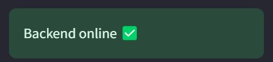
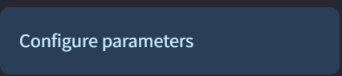
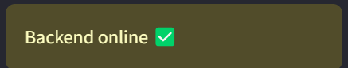
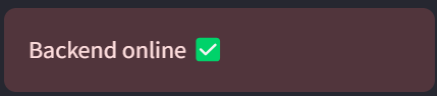
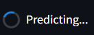
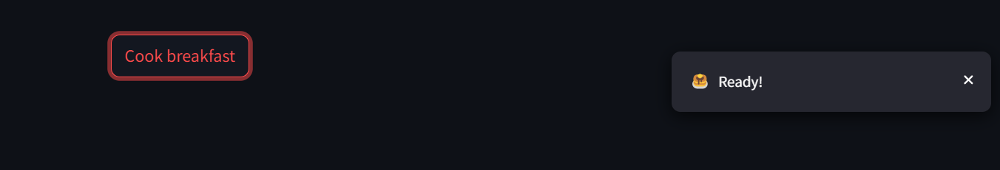

## Streamlit Introduction

Data Science models often need to be shared and presented in an interactive manner for various applications. Streamlit provides a convenient platform to build user-friendly interfaces, allowing practitioners to showcase their remarkable machine learning models to a broader audience effectively.

## Lab objective
In this lab, we implement a Simple Linear Regression model that follows the pattern Y = 2X + 3 + noise and create a user-friendly Streamlit interface to interact with the model. The dashboard allows users to input X values and get Y predictions from the trained linear regression model.

## Installing required packages

There are two ways to install the required packages for this lab.

### Installing from requirements.txt file

The Lab folder comes with a requirements.txt file. We will first setup a virtual environment, and install all the required packages into the environment. Finally, we will activate the environment. This is a recommended setup for any Python project since a virtual environment in Python isolates your project's dependencies from your system's installed libraries and other virtual environments. This prevents conflicts and ensures you have the exact versions of packages.


1. Create virual environment with the name `streamlitenv`.
```
python3 -m venv streamlitenv 
```

2. Activate virtual environment    

For Mac & Linux:    
```
source ./streamlitenv/bin/activate
```
For Windows:   
```
.streamlitenv\Scripts\activate
```

3. Installing packages from requirements.txt
```
pip install -r requirements.txt
```

### Alternative method to installing packages for lab
Alternative method is to install these packages:

```
pip install streamlit pandas numpy scikit-learn matplotlib seaborn pathlib
```

You could do this in a virtual environment as directed above section.

## Hello World in Streamlit

The best way to explore a new package is to start with the `hello world` equivalent. So, to run the streamlit application,

```
streamlit hello
```

This will start a server on default port `8501` with an interactive dashboard. The hello world streamlit dashboard showcases some intresting usecases, so don't forget to click around and explore further.


## Building the UI Step-by-step
When creating a dashboard, the initial phase involves determining its layout structure. For this particular demonstration, we will incorporate a side panel and a primary body section. The side panel will serve as an input area for X values, while the main body will display the linear regression predictions and model information.

### Building the sidebar
```Python
import streamlit as st
from streamlit.logger import get_logger
from predict import predict

LOGGER = get_logger(__name__)

def run():
    st.set_page_config(
        page_title="Linear Regression Predictor",
        page_icon="📈",
    )

    with st.sidebar:
        st.info("Enter X value for prediction")

        # Input for X value
        x_value = st.number_input(
            "Enter X value:",
            value=0.0,
            step=1.0,
            help="Enter any numeric value for X to get Y prediction"
        )

        # Predict button
        predict_button = st.button('Predict Y')

if __name__ == "__main__":
    run()
```

Let's break down the code and comprehend the design steps.

```Python
import streamlit as st
from streamlit.logger import get_logger
from predict import predict
```
We begin by importing the necessary modules:

1. streamlit library is for the front-end dashboard. It has its own logger for debugging purposes
2. predict function from our local predict.py module that contains the trained linear regression model     

Inside the run function, we start by customizing the title and icon for the browser tab:

```
st.set_page_config(
        page_title="Linear Regression Predictor",
        page_icon="📈",
    )
```
[`st.set_page_config docs`](https://docs.streamlit.io/library/api-reference/utilities/st.set_page_config)    

This following statement is the beginning of a context manager block that creates a sidebar in the Streamlit app. The `st.sidebar` object provides access to various methods and functions for creating user interface elements within the sidebar area of the Streamlit app.

For our linear regression model, we create a simple numeric input field where users can enter X values:

```Python
with st.sidebar:
    st.info("Enter X value for prediction")

    x_value = st.number_input(
        "Enter X value:",
        value=0.0,
        step=1.0,
        help="Enter any numeric value for X to get Y prediction"
    )
```

The following components are used to show different colored boxes:

1. [`st.success`](https://docs.streamlit.io/library/api-reference/status/st.success): shows a green box with message 



2. [`st.info`](https://docs.streamlit.io/library/api-reference/status/st.info): shows a blue box with message



3. [`st.warning`](https://docs.streamlit.io/library/api-reference/status/st.warning): shows a yellow box with message



4. [`st.error`](https://docs.streamlit.io/library/api-reference/status/st.error): shows a red box with message



For our linear regression model, we use a simple number input widget to allow users to enter any X value. The `st.number_input` widget is perfect for numeric inputs:

```Python
x_value = st.number_input(
    "Enter X value:",
    value=0.0,
    step=1.0,
    help="Enter any numeric value for X to get Y prediction"
)
```
[st.number_input docs](https://docs.streamlit.io/library/api-reference/widgets/st.number_input)

Here the parameters are explained below:
1. `label`: The name/prompt for the input field
2. `value`: The default/starting value
3. `step`: The increment/decrement step when using the +/- buttons
4. `help`: ? icon indicating more information on hovering

`🔥Note:` The value of the number input is directly stored into the variable. So, `x_value` in `x_value = st.number_input()` will store the current value entered by the user.

For our simple linear regression model, we keep the interface clean and straightforward. Users simply enter a numeric X value and get the corresponding Y prediction. This direct approach is perfect for demonstrating linear regression concepts and allows for quick testing of different input values.


Finally, to finish the sidebar panel, let's add the most important element, i.e., the predict button.

```Python
predict_button = st.button('Predict Y')
```

[`st.button docs`](https://docs.streamlit.io/library/api-reference/widgets/st.button)

---

### Building the body

The body will show the heading for the dashboard, and the prediction output.

For the heading, the [`st.write`](https://docs.streamlit.io/library/api-reference/write-magic/st.write) function Swiss Army knife of Streamlit and can render various forms of text output.

```
st.write("# Linear Regression Predictor! 📈")
st.write("### Y = aX + b")
```

For the prediction output, we create a placeholder.

```
result_container = st.empty()
```

The [`st.empty`](https://docs.streamlit.io/library/api-reference/layout/st.empty) adds a container into your app that can be used to hold a single element. This allows you to, for example, remove elements at any point, or replace several elements at once (using a child multi-element container).

In Streamlit, the [`st.spinner`](https://docs.streamlit.io/library/api-reference/status/st.spinner) and [`st.toast`](https://docs.streamlit.io/library/api-reference/status/st.toast) are two utility functions that will help us create better user experiences and provide feedback to users while their requests are being processed or completed.

1. `st.spinner`: Function is used to display a spinning animation or progress indicator to the user.



2. `st.toast`: Function is used to display a temporary message or notification to the user



Finally, piecing together all this information gives

```Python
st.write("# Linear Regression Predictor! 📈")
st.write("### Y = aX + b")

if predict_button:
    try:
        # Get prediction using the predict function
        y_prediction = predict(x_value)

        # Display result
        st.success(
            f"**Input:** X = {x_value}\n\n"
            f"**Prediction:** Y = {y_prediction:.4f}"
        )

        # Show the linear equation form
        st.info(f"Using the trained linear regression model: Y = aX + b")

    except Exception as e:
        # Error handling
        st.error(f"Error making prediction: {str(e)}")
        LOGGER.error(f"Prediction error: {e}")

# Display some information about the model
st.write("---")
st.write("### About the Model")
st.write("This dashboard uses a simple linear regression model trained on data following the pattern Y = 2X + 3 + noise.")
st.write("Enter an X value in the sidebar to see the model's prediction for Y.")
```

At this point, we have understood and built the linear regression dashboard. To run the streamlit server use the command:

```
streamlit run src/Dashboard.py
```

This will start the dashboard where you can:
1. Enter any X value in the sidebar
2. Click "Predict Y" to get the linear regression prediction
3. View the result showing both input and predicted output

## Additional information

The above code generates a SPA (Single Page Application) that could act as a self-contained dashboard. However, in most cases, we aim to develop multi-page applications. Streamlit offers a straightforward, predefined structure for building multi-page applications. The process is as simple as adding additional pages to the Pages directory, following a naming convention like 1_A, 2_B, 3_C, and so on, where A, B, and C represent different pages, respectively. For more detailed information, you can refer to the official Streamlit documentation on creating a multi-page app. [`Docs link`](https://docs.streamlit.io/get-started/tutorials/create-a-multipage-app)

`🔥Note`: The first page gets the same name as the main file name. So, since our file is named as Dashboard, streamlit assigns Dashboard as the first tab name.


## Training the Model

To train the linear regression model, run:
```
python src/model.py
```

This will:
1. Generate synthetic data following Y = 2X + 3 + noise pattern
2. Train a linear regression model
3. Save model parameters to `model/model_parameters.csv`
4. Generate visualization plots in `assets/model_analysis.png`