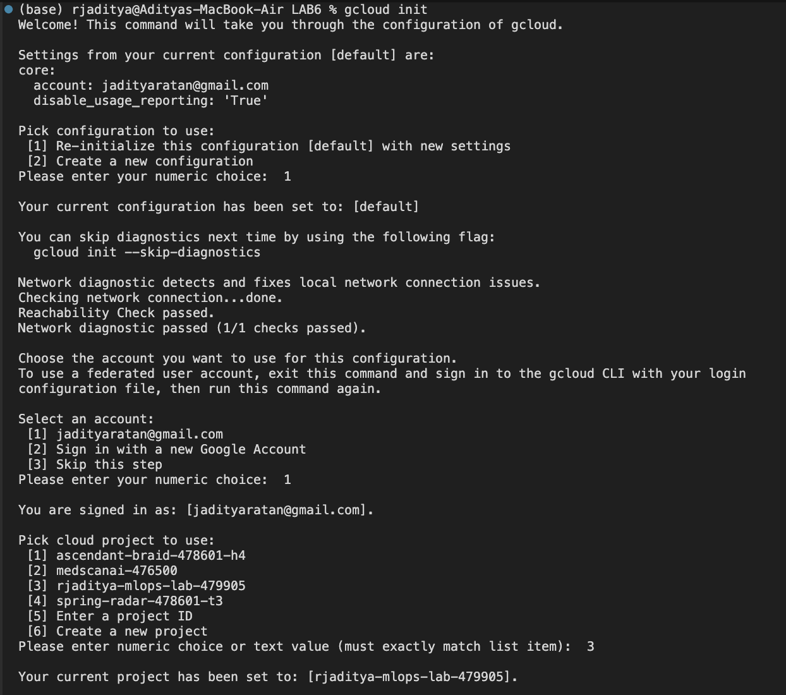
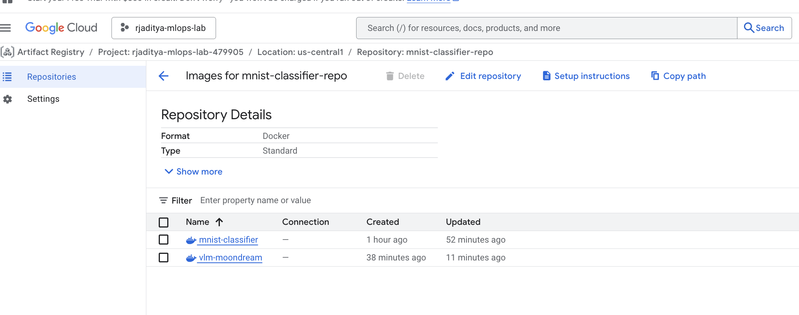
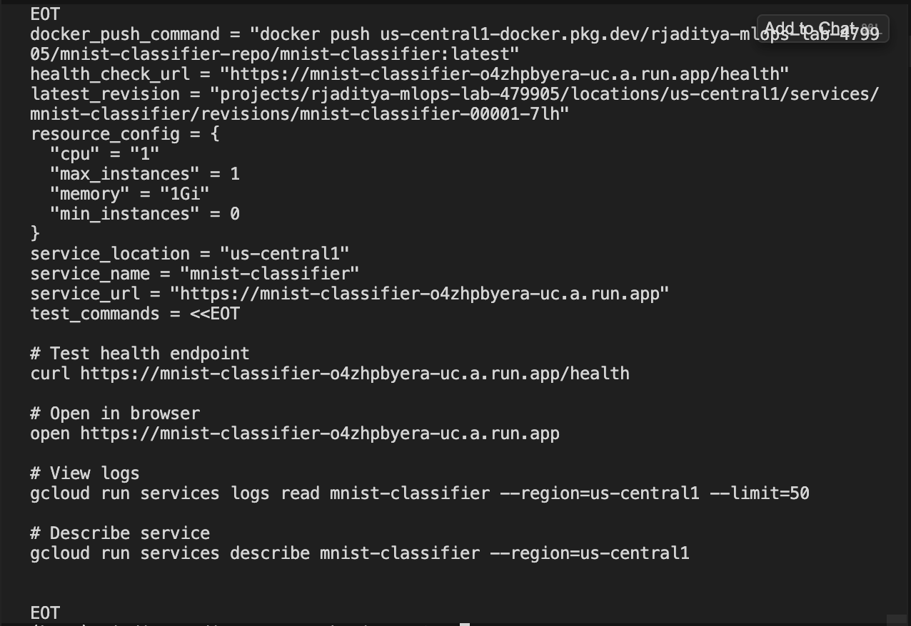
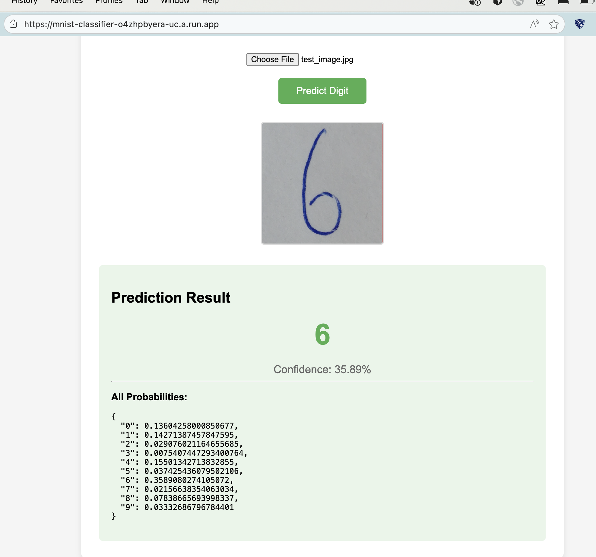
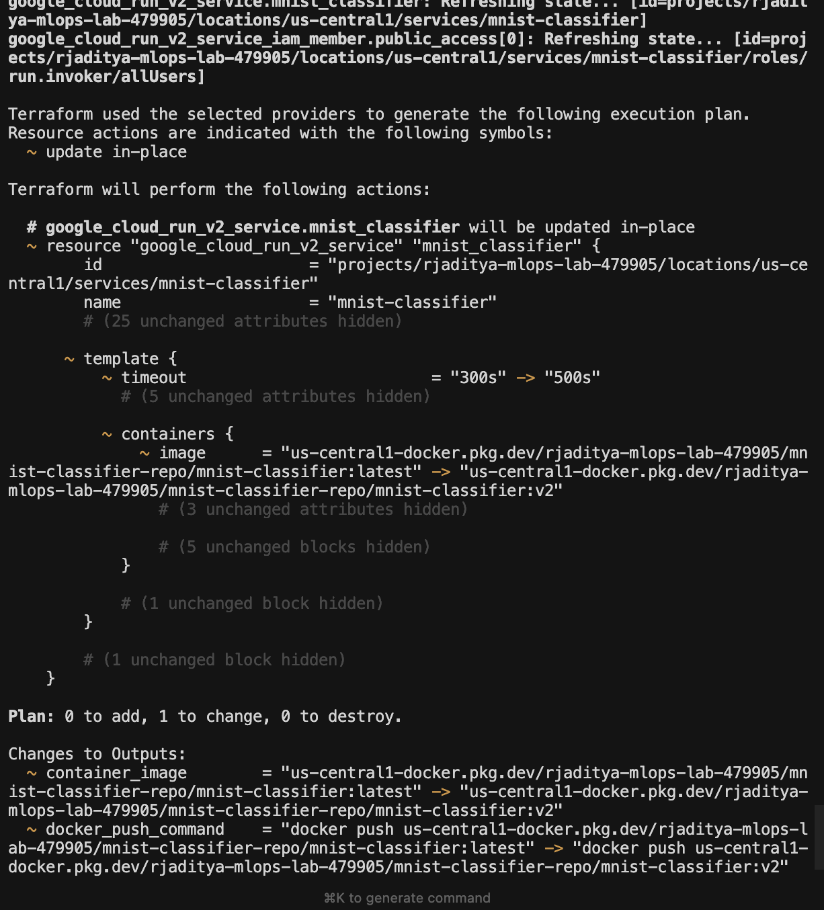
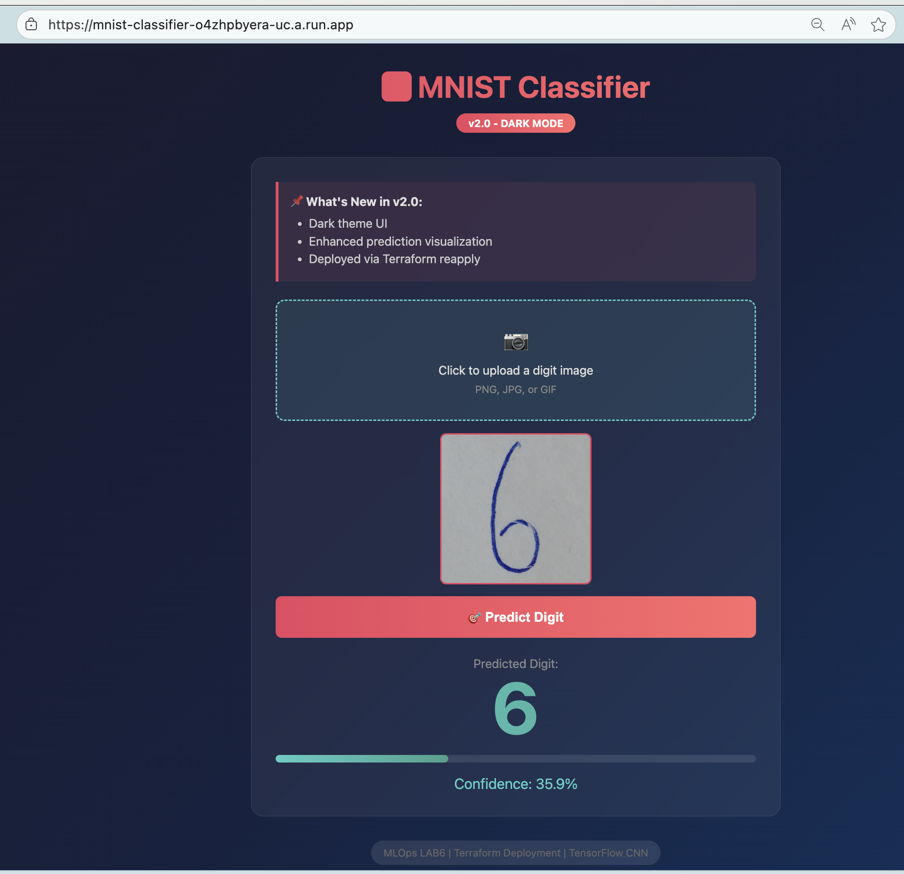
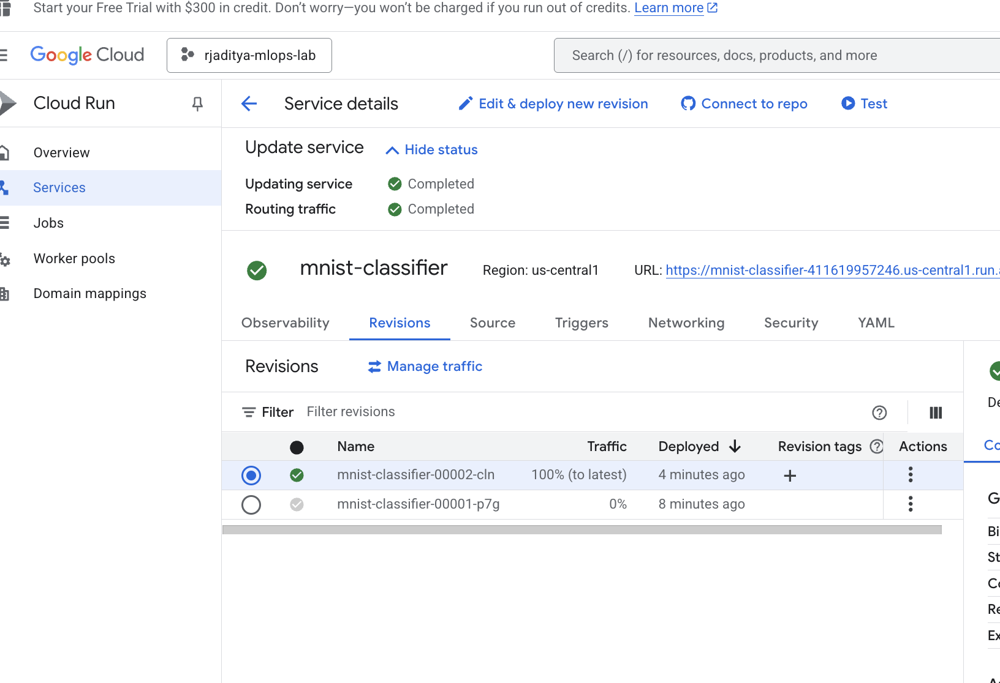
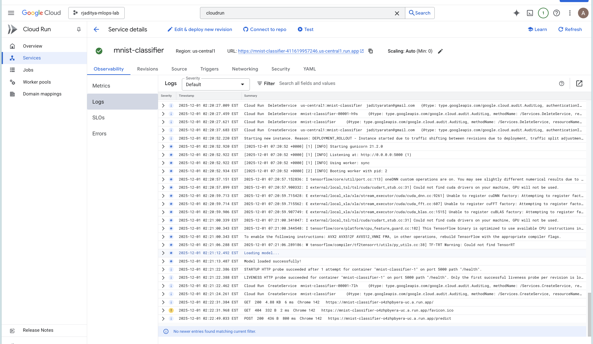
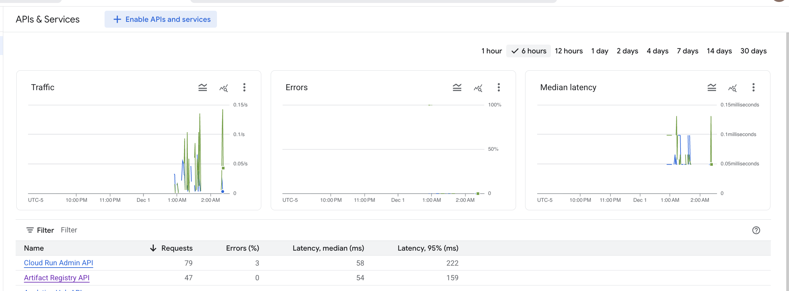

# LAB6: Terraform on Google Cloud Platform

Infrastructure as Code (IaC) with Terraform for deploying ML models to GCP Cloud Run.

## Objective

Demonstrate the complete Terraform lifecycle:

1. **Deploy** MNIST Classifier v1 (Built in LAB5/)
2. **Modify** configuration and re-apply with v2
3. **Destroy** all resources

## Cost

| Resource | Cost |
|----------|------|
| Cloud Run | $0 when idle (scales to zero) |
| Free Tier | 2M requests/month |
| This Lab | ~$0 (destroy when done) |

---

## Prerequisites

### Tools

```bash
brew install terraform
brew install --cask docker
```

### Google Cloud SDK

```bash
cd ~
curl -O https://dl.google.com/dl/cloudsdk/channels/rapid/downloads/google-cloud-cli-darwin-arm.tar.gz
tar -xzf google-cloud-cli-darwin-arm.tar.gz
./google-cloud-sdk/install.sh
source ~/.zshrc
```

### GCP Setup

```bash
gcloud init
gcloud services enable run.googleapis.com artifactregistry.googleapis.com
gcloud auth configure-docker us-central1-docker.pkg.dev
gcloud auth application-default login
```



---

## Project Structure

```
LAB6/
├── main.tf              # Cloud Run + Artifact Registry
├── variables.tf         # Configurable parameters
├── outputs.tf           # Service URL output
├── terraform.tfvars     # Configuration values
├── mnist/
│   ├── app.py           # v1 (Green theme)
│   ├── app_v2.py        # v2 (Dark theme)
│   ├── Dockerfile       # v1 build
│   ├── Dockerfile.v2    # v2 build
│   ├── requirements.txt
│   └── model/
│       └── mnist_model.h5
└── assets/              # Screenshots
```

---

## Phase 1: Deploy MNIST v1

### Step 1: Configure

Edit `terraform.tfvars`:

```hcl
project_id = "rjaditya-mlops-lab-479905"
image_name = "mnist-classifier"
image_tag  = "latest"
```

### Step 2: Initialize Terraform

```bash
cd LAB6
terraform init
```

### Step 3: Create Infrastructure

```bash
terraform apply -target=google_project_service.artifactregistry_api \
  -target=google_project_service.run_api \
  -target=google_artifact_registry_repository.mnist_repo \
  -target=google_service_account.cloudrun_sa \
  -target=google_project_iam_member.cloudrun_sa_logging
```



### Step 4: Build and Push Docker Image

```bash
cd mnist
docker build --platform linux/amd64 -t mnist-classifier .
docker tag mnist-classifier us-central1-docker.pkg.dev/rjaditya-mlops-lab-479905/mnist-classifier-repo/mnist-classifier:latest
docker push us-central1-docker.pkg.dev/rjaditya-mlops-lab-479905/mnist-classifier-repo/mnist-classifier:latest
cd ..
```

### Step 5: Deploy Cloud Run

```bash
terraform apply
```



### Step 6: Test

```bash
open $(terraform output -raw service_url)
```



---

## Phase 2: Re-apply with v2

### Step 1: Build v2 Image

```bash
cd mnist
docker build --platform linux/amd64 -f Dockerfile.v2 -t mnist-classifier:v2 .
docker tag mnist-classifier:v2 us-central1-docker.pkg.dev/rjaditya-mlops-lab-479905/mnist-classifier-repo/mnist-classifier:v2
docker push us-central1-docker.pkg.dev/rjaditya-mlops-lab-479905/mnist-classifier-repo/mnist-classifier:v2
cd ..
```

### Step 2: Update Configuration

Edit `terraform.tfvars`:

```hcl
image_tag = "v2"  # Changed from "latest"
```

### Step 3: Plan Changes

```bash
terraform plan
```



### Step 4: Apply Changes

```bash
terraform apply
```

### Step 5: Verify

```bash
open $(terraform output -raw service_url)
```



### Cloud Run Revisions



---

## Phase 3: Destroy

```bash
terraform destroy
```

Verify cleanup:

```bash
gcloud run services list --region=us-central1
gcloud artifacts repositories list --location=us-central1
```

---

## Monitoring

### Logs

```bash
gcloud run services logs read mnist-classifier --region=us-central1 --limit=50
```



### Traffic



---

## Version Comparison

| Feature | v1 | v2 |
|---------|----|----|
| Theme | Green/Light | Red/Dark |
| Badge | None | "v2.0 - DARK MODE" |
| Confidence | Text | Progress bar |

---

## Terraform Commands

| Command | Purpose |
|---------|---------|
| `terraform init` | Initialize providers |
| `terraform plan` | Preview changes |
| `terraform apply` | Create/update resources |
| `terraform destroy` | Delete all resources |

---

## Troubleshooting

| Issue | Solution |
|-------|----------|
| Image not found | Push Docker image before apply |
| amd64/linux error | Build with `--platform linux/amd64` |
| Startup probe failed | Increase timeout in main.tf |

---

## Summary

| Phase | Action | Command |
|-------|--------|---------|
| 1 | Deploy v1 | `terraform apply` |
| 2 | Update to v2 | Edit tfvars → `terraform apply` |
| 3 | Cleanup | `terraform destroy` |
